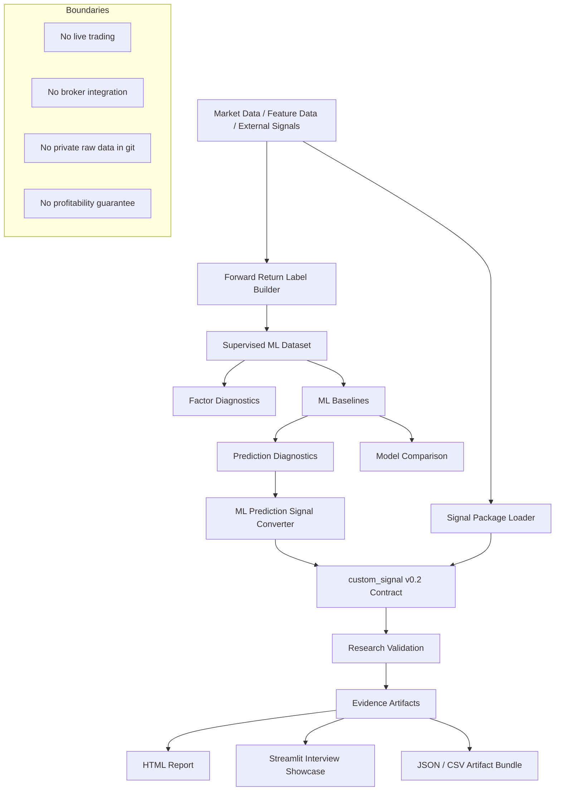

# AlphaForge

[English](README.md) | [繁體中文](README.zh-TW.md)

AlphaForge is a reproducible quantitative research framework for turning ML predictions, factor signals, and backtest experiments into inspectable evidence artifacts.

It is **not** a live trading system or a profitability claim. The project is designed to show how a trading idea or ML prediction can be tested through explicit data contracts, walk-forward validation, diagnostics, visual reports, and reviewable artifacts.

---

## Real-Data Research Showcase

AlphaForge currently demonstrates two real-data report routes:

| Route | Purpose | What it demonstrates |
| --- | --- | --- |
| **Route A — CRSP ML E2E Report** | Cross-sectional ML research pipeline | Dataset QC, walk-forward validation, Rank IC diagnostics, gross-of-cost portfolio path, limitations, artifact provenance |
| **Route B — TWSE Single-Experiment Report** | Single-name backtest/report engine | Real OHLCV ingestion, lagged execution semantics, fee/slippage assumptions, benchmark comparison, readable HTML report |

The main point is not that the baseline strategy is profitable. The main point is that AlphaForge can produce a complete, reproducible, and inspectable research workflow — including negative results.

---

### Route A — CRSP ML E2E: negative result shown explicitly

The CRSP ML E2E report runs a real CRSP monthly panel through a supervised-learning research pipeline:

```text
CRSP monthly panel
  → dataset QC
  → 10-year train / 1-year test walk-forward splits
  → sklearn ridge baseline
  → prediction IC / Rank IC diagnostics
  → gross-of-cost long-short prediction portfolio
  → HTML / JSON / parquet evidence artifacts
```


Interpretation:

The ridge baseline produced 0 / 17 positive Rank IC windows. Even the least-negative Rank IC window remained below zero, so this should be read as a negative ranking-stability diagnostic rather than a profitable ranking signal.

This is intentional. AlphaForge does not hide the result behind an equity curve. It surfaces the failure mode directly:

- the model has no stable cross-sectional ranking edge;
- the portfolio path is gross-of-cost and not transaction-cost adjusted;
- the report preserves limitations and artifact provenance instead of presenting the result as alpha.

A useful diagnostic split appears when comparing ranking quality with annual portfolio returns: the least-negative ranking window in 2020 was also a very poor portfolio year, while 2009 had weak ranking quality but strong portfolio return. This is why the report shows Rank IC, portfolio path, window diagnostics, and limitations together — portfolio return alone is not evidence of ranking skill.

#### Route A data scale and walk-forward setup


The current real-data CRSP run uses:

```text
Rows:         1,382,055
Assets:       14,281
Months:       335
Test windows: 17
Dataset:      1996-01-31 to 2023-11-30
Predictions:  2006-01-31 to 2022-12-31
```

The prediction period starts in 2006 because the first model uses 1996–2005 as the initial 10-year training window:

```text
train_1996-2005_test_2006
train_1997-2006_test_2007
...
train_2012-2021_test_2022
```

This means the early CRSP data are not missing; they are used as training data before the first out-of-sample test window.

---

### Route B — TWSE single-experiment report

Route B demonstrates AlphaForge’s single-experiment backtest/report engine using real TWSE OHLCV data.


This route is not presented as an alpha discovery. It is a reporting and execution-semantics demonstration:

- real OHLCV data ingestion;
- lagged close-to-close execution semantics;
- explicit fee/slippage assumptions;
- benchmark comparison rather than isolated strategy return;
- readable HTML cards, tables, equity/drawdown views, and trade diagnostics.

In the current TWSE report, the strategy can show positive total return while still underperforming buy-and-hold on excess return. That is the point: AlphaForge is designed to expose whether active timing actually adds value, not just whether an equity curve goes up.

---

## What AlphaForge Demonstrates

| Area | Evidence |
| --- | --- |
| Quant research | Forward-return labels, factor diagnostics, IC / Rank IC, walk-forward validation |
| Machine learning | sklearn baselines, PyTorch MLP baseline, prediction diagnostics, model comparison |
| Data engineering | Feature / label separation, CRSP / OAP / TWSE workflows, artifact contracts |
| Research hygiene | Explicit limitations, gross-of-cost labels, no private raw data in git |
| Reporting | HTML reports, visual diagnostics, JSON / parquet / CSV evidence artifacts |
| Software engineering | `src/` package layout, CLI workflows, tests, reproducible smoke commands |

---

## Core Principle

Many quant side projects stop at one backtest chart.

AlphaForge focuses on the layer before any serious claim can be made:

- build explicit feature and label contracts;
- run deterministic model / signal workflows;
- evaluate predictions with diagnostics rather than a single PnL line;
- expose negative results and limitations;
- export artifacts that can be inspected, reproduced, and discussed in an interview.

The goal is not to claim that a specific strategy is profitable.
The goal is to prove that the research process is reproducible, inspectable, and extensible.

---

## System Overview

```text
Data / Features / External Signals
  → Forward Return Labels
  → Supervised ML Dataset
  → Factor + Prediction Diagnostics
  → Regression / Classification Baselines
  → custom_signal v0.2 Signal Construction
  → Research Validation
  → Model Comparison / Final Holdout Artifacts
  → Streamlit Interview Showcase / HTML Reports
```

Features and returns are kept as separate schemas. Signals carry target positions.
Backtests use lagged close-to-close execution with configurable semantics.

### Architecture Diagram



---

## Why This Project Matters

AlphaForge is built as a portfolio project for quantitative research, ML-driven
signal experimentation, and reproducible engineering practice.

It demonstrates that I can:

* design a research pipeline rather than only a one-off notebook
* separate raw data, features, labels, predictions, and signals
* build ML baselines without leaking target information into features
* evaluate predictions through diagnostics instead of relying on a single metric
* convert model output into explicit trading signal contracts
* generate reviewable artifacts for interview and research discussion
* maintain engineering discipline with tests, fixtures, CLI commands, and boundaries

---

## Current Capabilities

* `custom_signal` v0.1 long/flat and v0.2 long/short signal consumption
* SignalForge v0.2 package validation and smoke testing
* Open Source Asset Pricing characteristic processing
* OAP multi-factor signal builder with YAML configuration
* Forward-return label builder with month-end alignment
* ML dataset builder with feature inference and missing-label handling
* Single-factor diagnostics: coverage, distribution, IC, Rank IC, quantile returns
* ML prediction diagnostics and model comparison reports
* Closed-form baseline regressor using NumPy / pandas only
* Optional sklearn regression adapters
* Optional sklearn classifier baseline with predicted probabilities
* Optional CPU-friendly PyTorch MLP baseline
* ML prediction to `custom_signal` v0.2 converter
* Research validation artifacts for signal evaluation
* HTML artifact report renderer
* Streamlit interview showcase with artifact ZIP upload workflow
* Built-in MA crossover and breakout strategy families
* Grid search, train/test validation, walk-forward validation
* Strategy comparison and permutation diagnostics
* TWSE daily data fetch helpers

---

## Interview Demo

Generate a deterministic ML research run with built-in health checks:

```bash
bash scripts/run_interview_demo.sh artifacts/demo/interview_ml_demo_C
```

Launch the Streamlit showcase:

```bash
python3 -m pip install -e ".[dashboard]"
streamlit run streamlit_app.py
```

The script verifies key demo health checks, including:

```text
nonzero_target_weight_count > 0
extra_signal_dates == []
```

The showcase displays:

* run overview
* health checks
* signal exposure
* prediction diagnostics
* final-holdout metrics
* equity curve
* drawdown
* trade log
* embedded HTML report
* artifact trace
* project boundaries

Package an existing run for Streamlit Cloud or another machine:

```bash
bash scripts/package_interview_artifacts.sh \
  artifacts/demo/interview_ml_demo_C \
  artifacts/demo/interview_ml_demo_C.zip
```

For real-data demos, raw or licensed data should remain local. Only
permission-safe derived artifacts should be packaged for external review.

---

## Latest Real-Data Research Finding

AlphaForge now includes an external CRSP monthly workflow covering panel
validation, Mom12m benchmark construction, supervised ML dataset generation,
walk-forward sklearn baselines, result diagnostics, cross-sectional preprocessing,
and ML experiment comparison.

The first raw-feature ML baseline did not clearly outperform the Mom12m benchmark.
Cross-sectional rank preprocessing improved prediction ranking quality directionally,
but the current evidence is not strong enough to claim robust alpha.

---

## Evidence of Engineering Quality

AlphaForge is structured to be verifiable rather than merely described.

Recommended validation commands:

```bash
PYTHONPATH=src python3 -m pytest -q
ruff check
git diff --check
```

The repository uses deterministic fixtures and generated artifacts to test the
research pipeline without committing private or licensed market data.

Key evidence artifacts include:

```text
metrics_summary.json
predictions.csv
ml_signal.csv
factor_summary.json
model_comparison.json
equity_curve.csv
trade_log.csv
validation_summary.json
report.html
```

---

## Boundaries

AlphaForge intentionally does **not** claim to be:

* a live trading system
* a broker integration layer
* a profitability guarantee
* a CRSP / WRDS downloader
* a complete portfolio optimizer
* a replacement for point-in-time institutional data infrastructure

Fixture metrics are integration and regression-test evidence, not investment
performance claims.

Current technical boundaries:

* Streamlit showcase reads generated artifacts; it does not train models or place orders.
* Current `custom_signal` runtime validation is single-symbol; multi-symbol portfolio validation is future work.
* SignalForge integration is file-based; AlphaForge does not import SignalForge runtime code.
* OAP characteristics are predictors, not realized returns; labels must come from a separate return source.
* `available_at` is currently a signal/data contract field, not a runtime execution-timing driver.

---

## Portfolio Context

AlphaForge is the core research and validation engine in my portfolio.

It connects with my other projects as follows:

```text
SignalForge
  → generates standardized factor / signal artifacts

AlphaForge
  → validates signals, runs ML experiments, produces research artifacts

bs_pricer
  → demonstrates financial engineering model implementation

agent-taskflow
  → demonstrates human-gated automation, validation, and proof-of-work workflows
```

Together, these projects show a broader direction:

> building reproducible quantitative research tools with strong engineering
> boundaries, testability, and reviewable evidence.

## Quick Start

```bash
python3 -m venv .venv
source .venv/bin/activate
python -m pip install -e ".[dev]"
```

Run commands directly without installing:

```bash
PYTHONPATH=src python3 -m alphaforge.cli --help
```

## Reproducible Smoke Commands

```bash
# Full test suite
PYTHONPATH=src python3 -m pytest -q

# Convert ML predictions to custom_signal v0.2
PYTHONPATH=src python3 -m alphaforge.cli build-ml-signal \
  --predictions tests/fixtures/ml_signal/predictions.csv \
  --output artifacts/phase24/ml_signal.csv \
  --asset-id-col asset_id \
  --date-col date \
  --prediction-col predicted_return \
  --long-quantile 0.8 \
  --short-quantile 0.2

# End-to-end ML artifact smoke
PYTHONPATH=src python3 scripts/run_ml_artifact_smoke.py \
  --features tests/fixtures/return_labels/features.csv \
  --returns tests/fixtures/return_labels/monthly_returns.csv \
  --output-dir artifacts/phase25/ml_artifact_smoke

# Interview ML demo + artifact report
bash scripts/run_interview_demo.sh artifacts/demo/interview_ml_demo_C

# Streamlit interview showcase
python -m pip install -e ".[dashboard]"
streamlit run streamlit_app.py

# Artifact ZIP for Streamlit upload
bash scripts/package_interview_artifacts.sh \
  artifacts/demo/interview_ml_demo_C \
  artifacts/demo/interview_ml_demo_C.zip
```

## Data Model

### Market Data

OHLCV data for one-symbol backtests:

```text
datetime, open, high, low, close, volume, symbol
```

### Signal Schema

v0.1 (long/flat):

```text
datetime, available_at, symbol, signal_name, signal_value, signal_binary, source
```

`signal_binary` maps to target position `1.0` or `0.0`.

v0.2 (long/flat/short):

```text
datetime, available_at, symbol, asset_id, signal_name, score, direction, target_weight, source
```

`target_weight` must be within `[-1.0, 1.0]`. SignalForge v0.2 requires
`signed_close_to_close_lagged` execution semantics.

`available_at` is preserved and validated as part of the signal/data contract,
but current backtest timing is not driven by that column. Current lookahead
controls are the feature/label contract, time-based train/test splitting,
forward-label construction, and lagged close-to-close execution semantics.
Future runtime timing work should make `available_at` an execution-time input
explicitly rather than relying on its presence alone.

### Feature Schema

```text
asset_id, date, <feature columns>
```

### Label Schema

```text
asset_id, date, target_date, horizon_months, ret_fwd_1m, source
```

### Backtest Outputs

```text
metrics_summary.json, equity_curve.csv, trade_log.csv, ranked_results.csv
validation_summary.json, walk_forward_summary.json, permutation_test_summary.json
```

## OAP / Open Source Asset Pricing

AlphaForge processes OAP firm-level characteristics as monthly predictors. No
bundled downloader — place raw files locally under `data/raw/oap/` and keep them
out of git.

The locally verified raw OAP file contains 209 characteristic columns. Current
examples focus on a selected 2010–2012 feature subset including Mom12m, BM,
AssetGrowth, Beta, OperProf, and Investment. Missingness is expected for
firm-level characteristics, especially accounting-based predictors.

Processed files use the convention:

```text
asset_id, date, <feature columns>   (Parquet preferred)
```

## OAP Multi-Factor Signal Builder

Combine multiple OAP feature columns into a v0.2 `signal.csv` via YAML config:

```yaml
features:
  - name: Mom12m
    weight: 1.0
    higher_is_better: true
  - name: BM
    weight: 1.0
    higher_is_better: true
long_quantile: 0.8
short_quantile: 0.2
```

Per date, features are z-score normalized, inverted if needed, and combined into
a weighted score. Top/bottom quantile assets receive long/short target weights.

```bash
PYTHONPATH=src python3 -m alphaforge.cli build-oap-multifactor-signal \
  --features data/processed/oap/oap_panel_2010_2012_features.parquet \
  --config tests/fixtures/oap_multifactor/equal_weight.yaml \
  --output artifacts/phase21/oap_multifactor_signal.csv
```

## Return Label Builder

Convert monthly return panels into forward return labels with month-end alignment.

```bash
PYTHONPATH=src python3 -m alphaforge.cli build-return-labels \
  --returns tests/fixtures/return_labels/monthly_returns.csv \
  --output artifacts/phase22/return_labels.csv \
  --asset-id-col asset_id --date-col date --return-col ret --horizon-months 1
```

Delisting returns are supported via `--delisting-return-col dlret`.

## Single-Factor Diagnostics

Evaluate one factor against forward returns before treating it as a tradable
signal or ML feature. Diagnostics include coverage, missingness, distribution,
IC, Rank IC, quantile forward returns, and top-minus-bottom long-short spread.

```bash
PYTHONPATH=src python3 scripts/run_factor_diagnostics.py \
  --panel artifacts/phase25/ml_artifact_smoke/supervised_panel.csv \
  --output-dir artifacts/phase28/mom12m_diagnostics \
  --factor-col Mom12m \
  --label-col ret_fwd_1m \
  --quantiles 5
```

Outputs: `factor_summary.json`, `factor_coverage_by_date.csv`,
`factor_distribution_by_date.csv`, `factor_ic_timeseries.csv`,
`factor_quantile_returns.csv`, `factor_long_short_spread.csv`.

## ML Baseline Scaffold

Closed-form OLS ridge regression (alpha=1.0), median imputation, standard
scaling. No scikit-learn dependency.

```bash
PYTHONPATH=src python3 -m alphaforge.cli run-ml-baseline \
  --panel tests/fixtures/ml_baseline/supervised_panel.csv \
  --output-dir artifacts/phase23/ml_baseline \
  --label-col ret_fwd_1m --train-end 2024-03-31 \
  --feature-cols Mom12m,BM,Investment
```

Outputs: `dataset.csv`, `predictions.csv`, `metrics_summary.json`.

## sklearn Regression Model Adapters

Optional sklearn-backed regression models (Ridge, Random Forest,
HistGradientBoosting) that output `predictions.csv` compatible with the
Phase 30 ML prediction diagnostics.

Install sklearn support:

```bash
python3 -m pip install -e ".[sklearn]"
```

```bash
PYTHONPATH=src python3 scripts/run_sklearn_ml_model.py \
  --panel tests/fixtures/ml_baseline/supervised_panel.csv \
  --output-dir artifacts/phase32/sklearn_ridge_demo \
  --model ridge_regressor \
  --label-col ret_fwd_1m \
  --train-end 2024-03-31 \
  --feature-cols Mom12m,BM,Investment
```

Outputs: `predictions.csv`, `metrics.json`, `model_summary.json`,
`train_config.json`, `feature_importance.csv`.

## sklearn Classifier Baseline

Optional sklearn-backed classification models create binary forward-return labels
and predicted probabilities for meta-labeling style experiments.

```bash
PYTHONPATH=src python3 scripts/run_sklearn_classifier_baseline.py \
  --features tests/fixtures/ml_demo_pipeline/features.csv \
  --returns tests/fixtures/ml_demo_pipeline/monthly_returns.csv \
  --output-dir artifacts/phase45a/classifier_baseline \
  --classifier logistic_regression_classifier \
  --feature-cols Mom12m,BM,Investment \
  --return-label-col ret_fwd_1m \
  --classification-label-col ret_fwd_1m_positive \
  --classification-threshold 0.0 \
  --train-end 2024-03-31
```

Outputs: `classification_labels.csv`, `supervised_classifier_panel.csv`,
`predictions.csv`, `metrics.json`, `feature_importance.csv`, and summary JSON.

## PyTorch MLP Baseline

Optional CPU-friendly PyTorch MLP regression baseline for supervised tabular
asset-pricing experiments. Two hidden layers with ReLU activation and dropout.

```bash
python3 -m pip install -e ".[torch]"

PYTHONPATH=src python3 scripts/run_torch_mlp_baseline.py \
  --panel tests/fixtures/ml_baseline/supervised_panel.csv \
  --output-dir artifacts/phase34/torch_mlp_demo \
  --label-col ret_fwd_1m \
  --train-end 2024-03-31 \
  --feature-cols Mom12m,BM,Investment \
  --epochs 5 \
  --batch-size 4 \
  --hidden-dim 32
```

Outputs: `predictions.csv`, `metrics.json`, `model_summary.json`,
`train_config.json`, `training_history.csv`, `feature_importance.csv`.

Predictions are compatible with Phase 30 ML prediction diagnostics.
Feature importance is not extracted for torch MLP models.
See `docs/phase-34-lightweight-torch-mlp.md` for full boundary and validation.

## ML Prediction Signal Converter

Converts `predictions.csv` into v0.2 `signal.csv` with quantile-based
long/short/neutral directions. Realized labels are ignored; only predicted scores
drive signal construction.

```bash
PYTHONPATH=src python3 -m alphaforge.cli build-ml-signal \
  --predictions tests/fixtures/ml_signal/predictions.csv \
  --output artifacts/phase24/ml_signal.csv \
  --asset-id-col asset_id --date-col date \
  --prediction-col predicted_return \
  --long-quantile 0.8 --short-quantile 0.2
```

## End-to-End ML Artifact Smoke

Runs the full pipeline from fixtures: features + returns → labels → dataset →
model → predictions → v0.2 signal → HTML report. Proves integration, not
strategy profitability.

```bash
PYTHONPATH=src python3 scripts/run_ml_artifact_smoke.py \
  --features tests/fixtures/return_labels/features.csv \
  --returns tests/fixtures/return_labels/monthly_returns.csv \
  --output-dir artifacts/phase25/ml_artifact_smoke
```

Generates: `return_labels.csv`, `supervised_panel.csv`, `dataset.csv`,
`predictions.csv`, `metrics_summary.json`, `ml_signal.csv`, `report.html`,
`smoke_summary.json`.

## Interview Streamlit Showcase

The interview showcase visualizes generated artifact directories without
retraining or rerunning validation. It supports local artifact runs, uploaded ZIP
bundles, and embedded HTML reports.

```bash
python -m pip install -e ".[dashboard]"
bash scripts/run_interview_demo.sh artifacts/demo/interview_ml_demo_C
streamlit run streamlit_app.py
```

Package a run for upload:

```bash
bash scripts/package_interview_artifacts.sh \
  artifacts/demo/interview_ml_demo_C \
  artifacts/demo/interview_ml_demo_C.zip
```

See `docs/phase-56-interview-streamlit-showcase.md` and
`docs/streamlit-showcase-deployment.md` for the showcase and deployment workflow.

## Local Research Dashboard

The local dashboard visualizes a generated artifact directory without uploading
private data. It displays pipeline file status, JSON summaries, table
shapes/previews, and the generated HTML report.

```bash
python -m pip install -e ".[dashboard]"
PYTHONPATH=src streamlit run src/alphaforge/dashboard_app.py
```

Default artifact directory:

```text
artifacts/phase25/ml_artifact_smoke
```

See `docs/phase-27-local-research-dashboard.md` for the full Phase 27 boundary
and validation commands.

## SignalForge Integration

AlphaForge consumes SignalForge v0.2 packages through file artifacts — no
runtime import of SignalForge internals.

A package directory contains `market_data.csv`, `signal.csv`,
`signal_contract.yaml`, `data_quality_report.json`, and `manifest.json`.
AlphaForge validates the manifest, loads the signal through `custom_signal` v0.2,
and runs a signed long/short smoke backtest.

```bash
PYTHONPATH=src python3 -m alphaforge.cli smoke-signalforge-package \
  --package sample_data/signalforge/demo_v02_package
```

For `custom_signal`, AlphaForge treats the supplied signal as frozen external
input. It validates schema and alignment, then runs development/holdout
evaluation and walk-forward validation — but does not perform parameter search
over SignalForge internals.

See `docs/signalforge-alphaforge-e2e-workflow.md` for the full SignalForge →
AlphaForge package, smoke-test, and research-validation workflow.

## HTML Artifact Reports

Standalone HTML reports with Plotly equity/drawdown charts, metric cards, and
trade log tables.

```bash
PYTHONPATH=src python3 -m alphaforge.cli render-artifact-report \
  --artifact-dir outputs/some_run --output outputs/some_run/report.html
```

The renderer reads whatever artifacts are present and reports missing files
gracefully.

## Built-In Strategies

MA crossover and breakout strategy families with grid search, train/test
validation, walk-forward, and permutation diagnostics.

```bash
PYTHONPATH=src python3 -m alphaforge.cli run \
  --data sample_data/sample_ohlcv.csv --symbol SAMPLE \
  --short-window 2 --long-window 4

PYTHONPATH=src python3 -m alphaforge.cli search \
  --data sample_data/sample_ohlcv.csv --symbol SAMPLE \
  --short-windows 2 3 --long-windows 4 5 --experiment-name sample_search
```

## Testing

```bash
PYTHONPATH=src python3 -m pytest -q            # full suite
PYTHONPATH=src python3 -m pytest -q -x          # stop on first failure
```

All tests use small deterministic fixtures under `tests/fixtures/`.

## Data Hygiene

Do not commit private datasets or generated artifacts. The following stay ignored:

```text
artifacts/   data/raw/   data/processed/   data/**/*.csv   data/**/*.parquet   outputs/
```

Checked-in fixtures under `tests/fixtures/` and `sample_data/` are small and
intended for deterministic tests.

## Limitations

- one-symbol `custom_signal` validation at runtime
- no CRSP/WRDS downloader or real-time data feeds
- no committed raw or processed OAP data
- current demos use fixtures or local artifacts and should not be interpreted as alpha claims
- multi-symbol portfolio validation is future work
- `available_at` is retained for contract compatibility but does not yet drive runtime execution timing

## Roadmap

- add classifier probability to signal conversion
- add multi-symbol custom_signal portfolio validation
- expand real-data artifact workflows after licensed data is available
- add factor diagnostics outputs to hosted showcase views
- formalize local loaders for processed OAP Parquet files
- keep SignalForge package compatibility aligned with v0.2 contract
