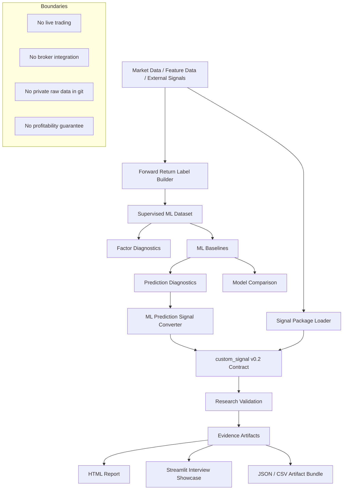

# AlphaForge

[English](README.md) | 繁體中文

AlphaForge 是一個以機器學習與量化研究流程為核心的可重現研究框架，用於處理資產定價訊號、監督式學習實驗、自訂交易訊號驗證，以及可供審查的研究 artifacts。

這個專案想回答的核心問題是：

> 一個候選交易訊號或機器學習預測結果，是否能被轉換成可追蹤、可驗證、可審查的研究成果，而不是只停留在單一 backtest 圖表或不可重現的 notebook？

AlphaForge 不是實盤交易系統，也不是券商下單工具，更不是獲利保證。
它是一個 deterministic research toolchain，重點在於資料處理、標籤建構、模型實驗、訊號生成、研究驗證與成果展示。

---

## 作品集定位

| 面向   | AlphaForge 展示的能力                                                              |
| ---- | ----------------------------------------------------------------------------- |
| 量化研究 | 因子診斷、forward-return labels、walk-forward validation、回測 artifacts               |
| 機器學習 | sklearn baseline、PyTorch MLP baseline、prediction diagnostics、model comparison |
| 資料工程 | feature / return schema 分離、deterministic fixtures、artifact contracts          |
| 軟體工程 | `src/` package layout、CLI workflows、tests、可重現 smoke commands                  |
| 研究紀律 | 不把私有原始資料放入 git、明確限制與邊界、可重現報表                                                  |
| 成果展示 | Streamlit showcase、HTML report、JSON / CSV evidence artifacts                  |

---

## 這個專案解決什麼問題？

許多量化交易或機器學習 side project 只停留在：

* 一張 equity curve
* 一個策略績效表
* 一份 notebook
* 一段難以重現的 backtest code

AlphaForge 關注的是更前面的研究流程：

1. 載入 feature data 與外部 signal。
2. 在明確 schema 下建立 forward-return labels。
3. 建立 supervised ML dataset。
4. 執行 baseline ML models 與 prediction diagnostics。
5. 將模型預測轉換成 long / short / neutral signal contract。
6. 執行 research validation。
7. 匯出可被檢查、封裝、展示的 artifacts。

這個專案的目的不是宣稱某個策略一定有效，而是證明：

> 我能把量化研究流程做成可重現、可檢查、可延伸的工程系統。

---

## 系統流程

```text
Data / Features / External Signals
  → Forward Return Labels
  → Supervised ML Dataset
  → Factor + Prediction Diagnostics
  → Regression / Classification Baselines
  → custom_signal v0.2 Signal Construction
  → Research Validation
  → Model Comparison / Final Holdout Artifacts
  → Streamlit Interview Showcase / HTML Reports
```

Features 與 returns 被刻意分成不同 schema，避免把已實現的結果混入特徵資料。
Signals 以 target positions 表示，回測採用 lagged close-to-close execution semantics。

---

## 架構圖



---

## 目前能力

* `custom_signal` v0.1 long/flat 與 v0.2 long/short signal consumption
* SignalForge v0.2 package validation 與 smoke testing
* Open Source Asset Pricing characteristics processing
* OAP multi-factor signal builder
* Forward-return label builder
* ML dataset builder
* Single-factor diagnostics
* ML prediction diagnostics
* Model comparison reports
* NumPy / pandas closed-form baseline regressor
* Optional sklearn regression adapters
* Optional sklearn classifier baseline
* Optional CPU-friendly PyTorch MLP baseline
* ML prediction to `custom_signal` v0.2 converter
* Research validation artifacts
* HTML artifact report renderer
* Streamlit interview showcase
* Grid search、train/test validation、walk-forward validation
* Strategy comparison 與 permutation diagnostics
* TWSE daily data fetch helpers

---

## Interview Demo

產生 deterministic ML research demo：

```bash
bash scripts/run_interview_demo.sh artifacts/demo/interview_ml_demo_C
```

啟動 Streamlit showcase：

```bash
python3 -m pip install -e ".[dashboard]"
streamlit run streamlit_app.py
```

demo 會檢查關鍵 health checks，例如：

```text
nonzero_target_weight_count > 0
extra_signal_dates == []
```

Streamlit showcase 會展示：

* run overview
* health checks
* signal exposure
* prediction diagnostics
* final-holdout metrics
* equity curve
* drawdown
* trade log
* embedded HTML report
* artifact trace
* project boundaries

---

## 工程品質證據

建議驗證指令：

```bash
PYTHONPATH=src python3 -m pytest -q
ruff check
git diff --check
```

這個 repository 使用 deterministic fixtures 與 generated artifacts 來測試研究流程，不需要把私有或授權市場資料放進 git。

常見 evidence artifacts 包含：

```text
metrics_summary.json
predictions.csv
ml_signal.csv
factor_summary.json
model_comparison.json
equity_curve.csv
trade_log.csv
validation_summary.json
report.html
```

---

## 專案邊界

AlphaForge 不聲稱自己是：

* 實盤交易系統
* 券商串接工具
* 獲利保證
* CRSP / WRDS downloader
* 完整 portfolio optimizer
* point-in-time institutional data infrastructure 的替代品

Fixture metrics 是 integration / regression-test evidence，不是投資績效宣稱。

目前技術邊界：

* Streamlit showcase 讀取 generated artifacts；它不訓練模型，也不下單。
* 目前 `custom_signal` runtime validation 以 single-symbol 為主；multi-symbol portfolio validation 是後續方向。
* SignalForge integration 是 file-based；AlphaForge 不直接 import SignalForge runtime code。
* OAP characteristics 是 predictors，不是 realized returns；labels 必須來自獨立 return source。
* `available_at` 目前是 signal / data contract field，不是 runtime execution-timing driver。

---

## 與其他作品的關係

AlphaForge 是我目前作品集中的核心量化研究與驗證引擎。

```text
SignalForge
  → 產生標準化 factor / signal artifacts

AlphaForge
  → 驗證 signals、執行 ML experiments、產出 research artifacts

bs_pricer
  → 展示金融工程模型實作能力

agent-taskflow
  → 展示 human-gated automation、validation、proof-of-work workflow 設計能力
```

這四個作品共同呈現的方向是：

> 建立具備工程邊界、可測試性、可重現性與可審查證據的量化研究工具鏈。
