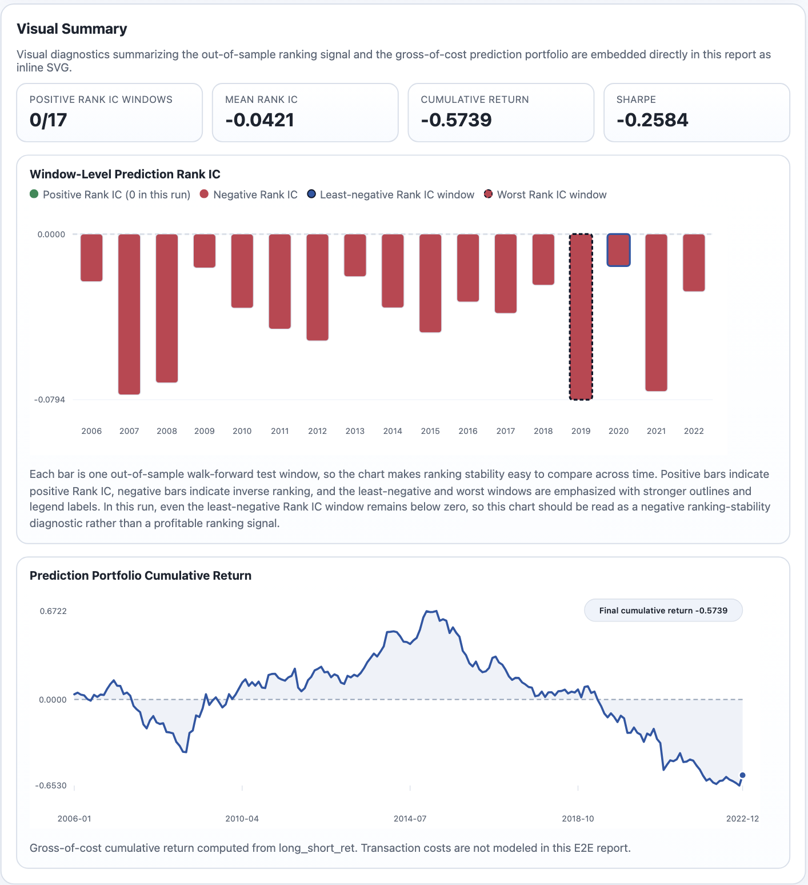
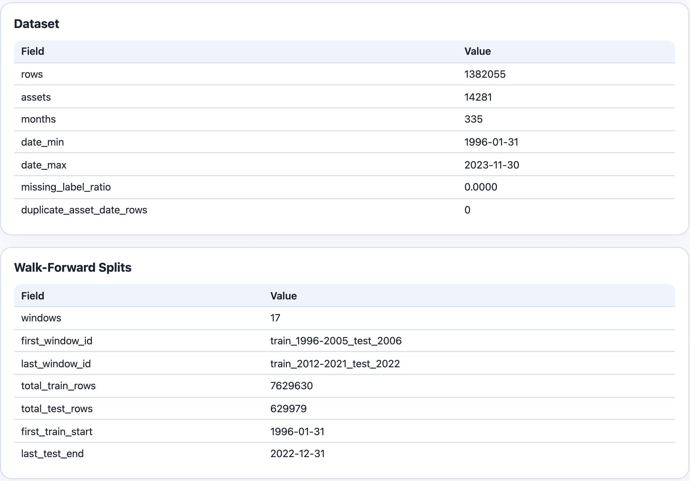
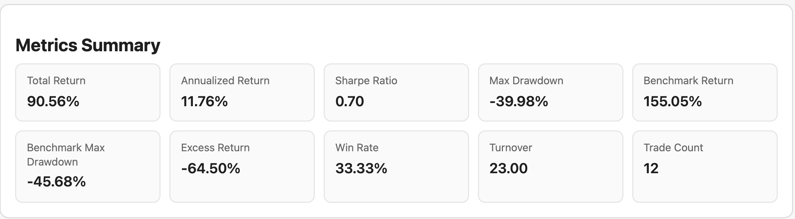
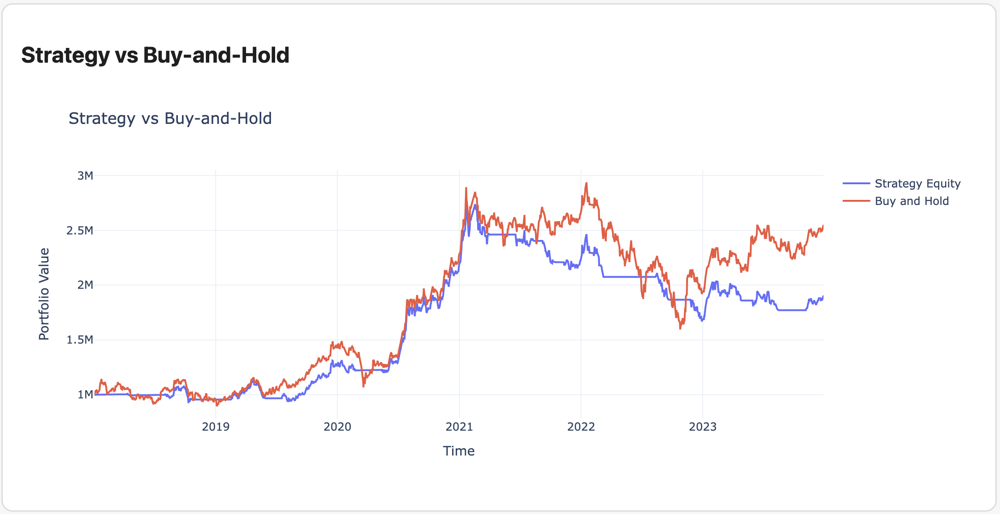
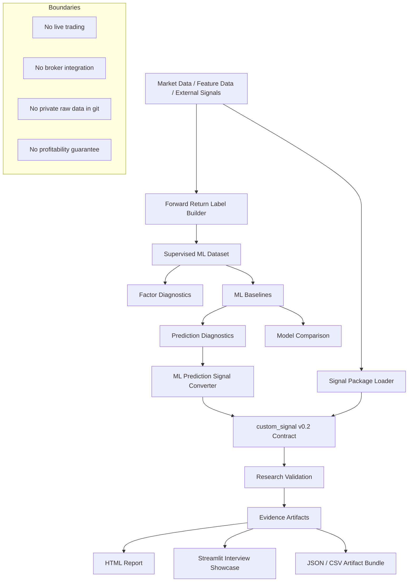

# AlphaForge

[English](README.md) | [繁體中文](README.zh-TW.md)

AlphaForge 是一套可重現的量化研究框架，用來把機器學習預測、因子訊號與回測實驗轉換成可檢查的研究證據 artifacts。

它不是實盤交易系統，也不是獲利保證。這個專案的重點是：一個交易想法或 ML prediction，能不能透過明確的資料契約、walk-forward validation、diagnostics、視覺化報表與可審查 artifacts，被轉換成嚴謹的研究流程。

---

## 真實資料研究展示

AlphaForge 目前有兩條真實資料展示路線：

| 路線 | 目的 | 展示內容 |
| --- | --- | --- |
| **Route A — CRSP ML E2E Report** | 橫斷面 ML 研究流程 | Dataset QC、walk-forward validation、Rank IC diagnostics、gross-of-cost portfolio path、limitations、artifact provenance |
| **Route B — TWSE Single-Experiment Report** | 單一標的 backtest/report engine | 真實 OHLCV 匯入、lagged execution semantics、fee/slippage assumptions、benchmark comparison、可讀 HTML report |

這個專案的重點不是宣稱 baseline strategy 能賺錢，而是展示 AlphaForge 能建立一套完整、可重現、可檢查的研究流程，包含負結果。

---

### Route A — CRSP ML E2E：明確呈現負結果

CRSP ML E2E report 將真實 CRSP monthly panel 跑過完整監督式學習研究流程：

```text
CRSP monthly panel
  → dataset QC
  → 10-year train / 1-year test walk-forward splits
  → sklearn ridge baseline
  → prediction IC / Rank IC diagnostics
  → gross-of-cost long-short prediction portfolio
  → HTML / JSON / parquet evidence artifacts
```



解讀：

這個 ridge baseline 在 17 個 out-of-sample windows 中沒有任何一個 Rank IC 為正。即使是最不差的 Rank IC window 也仍然低於 0，因此這張圖應該被理解成負面的 ranking-stability diagnostic，而不是可獲利訊號。

這是刻意保留的結果。AlphaForge 沒有把結果藏在一條 equity curve 後面，而是直接揭露模型的 failure mode：

- 模型沒有穩定的橫斷面排序能力；
- portfolio path 是 gross-of-cost，尚未納入 transaction costs；
- report 保留 limitations 與 artifact provenance，而不是把結果包裝成 alpha。

一個重要診斷是：portfolio return 與 ranking quality 不能混為一談。2020 是最不差的 Rank IC window，卻是很差的 portfolio year；2009 的 ranking quality 不好，但 portfolio return 很高。這正是為什麼 AlphaForge 同時呈現 Rank IC、portfolio path、window diagnostics 與 limitations，而不是只看單一 equity curve。

#### Route A 資料規模與 walk-forward 設計



目前真實 CRSP run 的規模：

```text
Rows:         1,382,055
Assets:       14,281
Months:       335
Test windows: 17
Dataset:      1996-01-31 to 2023-11-30
Predictions:  2006-01-31 to 2022-12-31
```

prediction period 從 2006 開始，是因為第一個模型使用 1996–2005 作為 10 年訓練區間：

```text
train_1996-2005_test_2006
train_1997-2006_test_2007
...
train_2012-2021_test_2022
```

也就是說，1996–2005 的資料並沒有消失，而是被用作第一個 out-of-sample test window 之前的 training data。

---

### Route B — TWSE 單一實驗報表

Route B 使用真實 TWSE OHLCV 資料展示 AlphaForge 的單一實驗 backtest/report engine。





這條路線不是 alpha discovery 宣稱，而是 report engine 與 execution semantics 展示：

- 匯入真實 OHLCV data；
- 使用 lagged close-to-close execution semantics；
- 顯式記錄 fee/slippage assumptions；
- 顯示 benchmark comparison，而不是只看策略本身報酬；
- 輸出可讀的 HTML cards、tables、equity/drawdown views 與 trade diagnostics。

目前 TWSE report 可以呈現策略 total return 為正，但相對 buy-and-hold 的 excess return 仍然為負。這正是 AlphaForge 的價值：它不是只問 equity curve 有沒有上升，而是檢查主動擇時是否真的增加價值。

---

## AlphaForge 展示的能力

| 面向 | 證據 |
| --- | --- |
| 量化研究 | Forward-return labels、factor diagnostics、IC / Rank IC、walk-forward validation |
| 機器學習 | sklearn baselines、PyTorch MLP baseline、prediction diagnostics、model comparison |
| 資料工程 | Feature / label separation、CRSP / OAP / TWSE workflows、artifact contracts |
| 研究紀律 | 明確 limitations、gross-of-cost labels、不將私有原始資料放入 git |
| 成果展示 | HTML reports、visual diagnostics、JSON / parquet / CSV evidence artifacts |
| 軟體工程 | `src/` package layout、CLI workflows、tests、可重現 smoke commands |

---

## 核心原則

許多量化 side project 只停在一張 backtest chart。

AlphaForge 關注的是更前面的研究流程：

- 建立明確的 feature 與 label contracts；
- 執行 deterministic model / signal workflows；
- 用 diagnostics 評估 prediction，而不是只看單一 PnL line；
- 誠實揭露負結果與 limitations；
- 匯出可檢查、可重現、可在面試中討論的 artifacts。

這個專案的目的不是宣稱某個策略一定有效。
它的目的，是證明研究流程本身具備可重現性、可檢查性與可延伸性。

---

## 系統流程

```text
Data / Features / External Signals
  → Forward Return Labels
  → Supervised ML Dataset
  → Factor + Prediction Diagnostics
  → Regression / Classification Baselines
  → custom_signal v0.2 Signal Construction
  → Research Validation
  → Model Comparison / Final Holdout Artifacts
  → Streamlit Interview Showcase / HTML Reports
```

Features 與 returns 被刻意分成不同 schema，避免把已實現的結果混入特徵資料。
Signals 以 target positions 表示，回測採用 lagged close-to-close execution semantics。

---

## 架構圖



---

## 目前能力

* `custom_signal` v0.1 long/flat 與 v0.2 long/short signal consumption
* SignalForge v0.2 package validation 與 smoke testing
* Open Source Asset Pricing characteristics processing
* OAP multi-factor signal builder
* Forward-return label builder
* ML dataset builder
* Single-factor diagnostics
* ML prediction diagnostics
* Model comparison reports
* NumPy / pandas closed-form baseline regressor
* Optional sklearn regression adapters
* Optional sklearn classifier baseline
* Optional CPU-friendly PyTorch MLP baseline
* ML prediction to `custom_signal` v0.2 converter
* Research validation artifacts
* HTML artifact report renderer
* Streamlit interview showcase
* Grid search、train/test validation、walk-forward validation
* Strategy comparison 與 permutation diagnostics
* TWSE daily data fetch helpers

---

## Interview Demo

產生 deterministic ML research demo：

```bash
bash scripts/run_interview_demo.sh artifacts/demo/interview_ml_demo_C
```

啟動 Streamlit showcase：

```bash
python3 -m pip install -e ".[dashboard]"
streamlit run streamlit_app.py
```

demo 會檢查關鍵 health checks，例如：

```text
nonzero_target_weight_count > 0
extra_signal_dates == []
```

Streamlit showcase 會展示：

* run overview
* health checks
* signal exposure
* prediction diagnostics
* final-holdout metrics
* equity curve
* drawdown
* trade log
* embedded HTML report
* artifact trace
* project boundaries

---

## 工程品質證據

建議驗證指令：

```bash
PYTHONPATH=src python3 -m pytest -q
ruff check
git diff --check
```

這個 repository 使用 deterministic fixtures 與 generated artifacts 來測試研究流程，不需要把私有或授權市場資料放進 git。

常見 evidence artifacts 包含：

```text
metrics_summary.json
predictions.csv
ml_signal.csv
factor_summary.json
model_comparison.json
equity_curve.csv
trade_log.csv
validation_summary.json
report.html
```

---

## 專案邊界

AlphaForge 不聲稱自己是：

* 實盤交易系統
* 券商串接工具
* 獲利保證
* CRSP / WRDS downloader
* 完整 portfolio optimizer
* point-in-time institutional data infrastructure 的替代品

Fixture metrics 是 integration / regression-test evidence，不是投資績效宣稱。

目前技術邊界：

* Streamlit showcase 讀取 generated artifacts；它不訓練模型，也不下單。
* 目前 `custom_signal` runtime validation 以 single-symbol 為主；multi-symbol portfolio validation 是後續方向。
* SignalForge integration 是 file-based；AlphaForge 不直接 import SignalForge runtime code。
* OAP characteristics 是 predictors，不是 realized returns；labels 必須來自獨立 return source。
* `available_at` 目前是 signal / data contract field，不是 runtime execution-timing driver。

---

## 與其他作品的關係

AlphaForge 是我目前作品集中的核心量化研究與驗證引擎。

```text
SignalForge
  → 產生標準化 factor / signal artifacts

AlphaForge
  → 驗證 signals、執行 ML experiments、產出 research artifacts

bs_pricer
  → 展示金融工程模型實作能力

agent-taskflow
  → 展示 human-gated automation、validation、proof-of-work workflow 設計能力
```

這四個作品共同呈現的方向是：

> 建立具備工程邊界、可測試性、可重現性與可審查證據的量化研究工具鏈。
